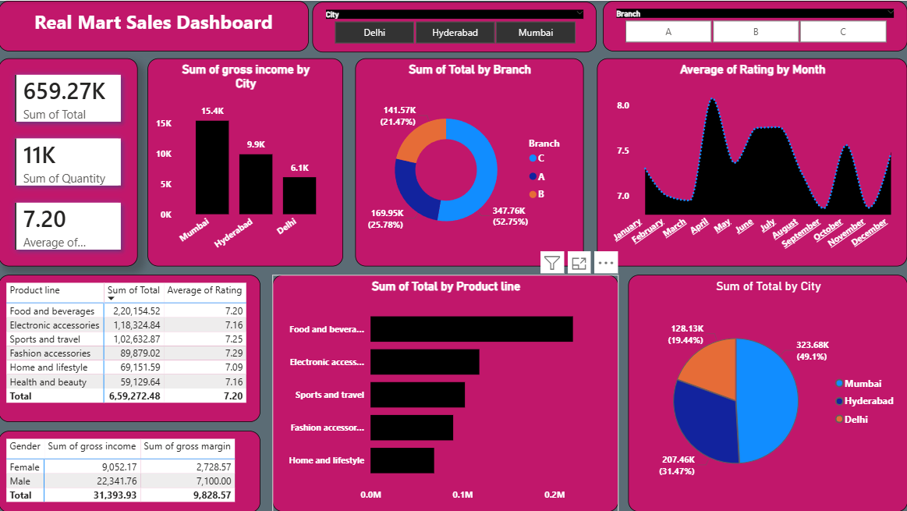

# Supermarket Sales Analysis Dashboard

## Project Overview
This project analyzes supermarket sales data using Power BI.
The objective is to identify sales trends, branch performance,
product line performance, and customer behavior patterns.

The dashboard provides interactive insights to help business
stakeholders make data-driven decisions.

---

## Business Objective
- Identify top performing branches
- Analyze monthly revenue trends
- Evaluate product line contribution
- Measure customer satisfaction using ratings
- Compare sales performance across cities

---

## Tools Used
- Power BI
- Power Query (Data Cleaning)
- DAX (Measures & KPIs)

---

## Key KPIs
- Total Revenue
- Total Quantity Sold
- Average Rating
- Branch-wise Sales
- Product Line Performance

---

## Key Insights
- Highest revenue branch identified
- Seasonal monthly sales patterns observed
- Food & Beverages contributed highest revenue
- Mumbai generated maximum overall sales
- Customer ratings remained stable across branches

---

## Dashboard Preview

